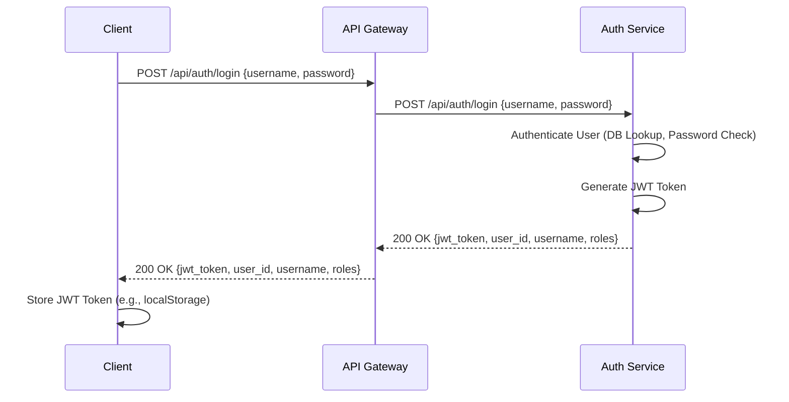
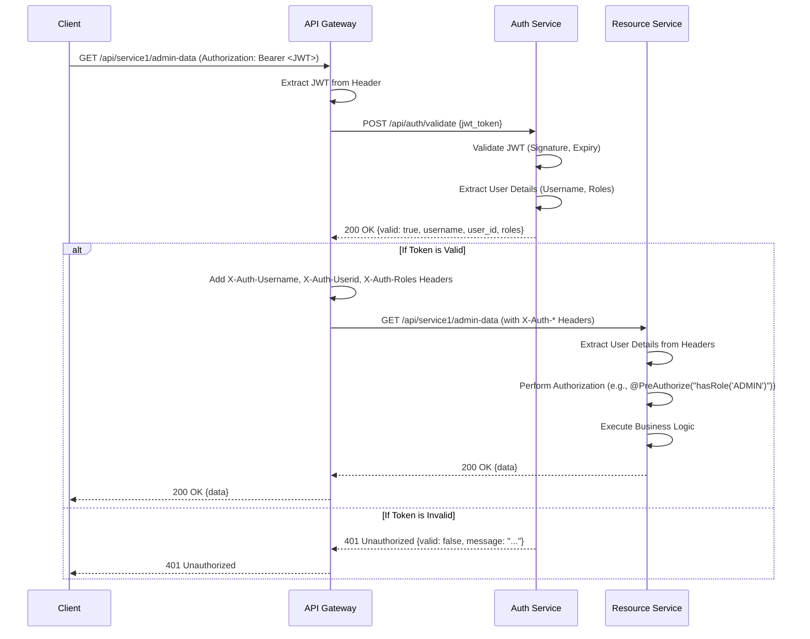

# Microservices Security Architecture: Centralized Authentication with API Gateway and JWT

This document outlines a robust and scalable security architecture for microservices using a dedicated Authentication Service, an API Gateway, and JSON Web Tokens (JWTs).

## Table of Contents

1.  [Architectural Overview]
      * [Component Breakdown]
      * [Architecture Diagram]
      * [Sequence Diagram: Login Flow]
      * [Sequence Diagram: Protected Resource Access Flow]
2.  [Auth Service (Centralized Authentication)]
      * [Purpose]
      * [Dependencies]
      * [Application Properties]
      * [Database Entities]
      * [Repositories]
      * [Custom UserDetailsService]
      * [JWT Utilities]
      * [Authentication Entry Point]
      * [Request/Response DTOs]
      * [Auth Controller]
      * [Security Configuration]
      * [Data Loader (for testing)]
3.  [API Gateway (Spring Cloud Gateway)]
      * [Purpose]
      * [Dependencies]
      * [Application Properties]
      * [Auth Service Client (Feign)]
      * [Token Validation Filter]
      * [Gateway Application Class]
4.  [Resource Service (Backend Microservice)]
      * [Purpose]
      * [Dependencies]
      * [Application Properties]
      * [Security Configuration]
      * [Header Authentication Filter]
      * [Example Controller]
      * [Application Class]
5.  [Running the Services]
6.  [Testing the Flow]

-----

## 1\. Architectural Overview

This architecture separates concerns for authentication and authorization in a microservices environment.

### Component Breakdown

  * **Client:** Could be a web browser (SPA), mobile app, or another service. Initiates requests.
  * **API Gateway (Spring Cloud Gateway):**
      * The single entry point for all client requests.
      * Handles **cross-cutting concerns** like routing, load balancing, rate limiting, and crucially, **API Security**.
      * Interacts with the Auth Service to validate JWTs.
      * Propagates authenticated user information (username, user ID, roles) to downstream Resource Services via HTTP headers.
  * **Auth Service (Centralized Authentication Service):**
      * A dedicated microservice responsible for user authentication (login), JWT issuance, and JWT validation.
      * Manages user credentials (username, hashed password, roles).
      * Does *not* handle business logic.
      * Only accessible directly by the API Gateway.
  * **Resource Services (Backend Microservices):**
      * Individual microservices that contain the core business logic.
      * **Trust the API Gateway:** They assume that any request arriving from the gateway has already been authenticated.
      * Extract user information (username, user ID, roles) from HTTP headers injected by the Gateway.
      * Perform **fine-grained authorization** based on the received user information using Spring Security's `@PreAuthorize`.
      * Do *not* directly handle JWT validation or user authentication.

### Architecture Diagram

```mermaid
graph TD
    A[Client] -->|1. Login (username/password)| B(API Gateway);
    B -->|2. Route to Auth Service| C[Auth Service];
    C -->|3. JWT Token| B;
    B -->|4. JWT Token| A;

    A -->|5. Protected Resource Request (with JWT)| B;
    B -->|6. Call Auth Service (validate JWT)| C;
    C -->|7. Validation Result (User details/roles)| B;
    B -->|8. Forward Request (with X-Auth-* Headers)| D[Resource Service];
    D -->|9. Process Request + Authorization| D;
    D -->|10. Response| B;
    B -->|11. Response| A;
```

### Sequence Diagram: Login Flow



### Sequence Diagram: Protected Resource Access Flow



-----

## 2\. Auth Service (Centralized Authentication)

This service is a Spring Boot application responsible for user management, authentication, and JWT token issuance/validation.

### Purpose (Auth)

  * To provide a centralized authentication mechanism for the entire microservice ecosystem.
  * To manage user accounts (username, hashed passwords, roles).
  * To issue and validate JWTs, which are then used by the API Gateway for subsequent requests.

### Dependencies (Auth)

`pom.xml` (Maven)

```xml
<?xml version="1.0" encoding="UTF-8"?>
<project xmlns="http://maven.apache.org/POM/4.0.0" xmlns:xsi="http://www.w3.org/2001/XMLSchema-instance"
         xsi:schemaLocation="http://maven.apache.org/POM/4.0.0 https://maven.apache.org/xsd/maven-4.0.0.xsd">
    <modelVersion>4.0.0</modelVersion>
    <parent>
        <groupId>org.springframework.boot</groupId>
        <artifactId>spring-boot-starter-parent</artifactId>
        <version>3.2.7</version> <relativePath/> </parent>
    <groupId>com.example</groupId>
    <artifactId>auth-service</artifactId>
    <version>0.0.1-SNAPSHOT</version>
    <name>auth-service</name>
    <description>Authentication Service for Microservices</description>
    <properties>
        <java.version>17</java.version>
    </properties>
    <dependencies>
        <dependency>
            <groupId>org.springframework.boot</groupId>
            <artifactId>spring-boot-starter-data-jpa</artifactId>
        </dependency>
        <dependency>
            <groupId>org.springframework.boot</groupId>
            <artifactId>spring-boot-starter-security</artifactId>
        </dependency>
        <dependency>
            <groupId>org.springframework.boot</groupId>
            <artifactId>spring-boot-starter-web</artifactId>
        </dependency>

        <dependency>
            <groupId>io.jsonwebtoken</groupId>
            <artifactId>jjwt-api</artifactId>
            <version>0.12.5</version>
        </dependency>
        <dependency>
            <groupId>io.jsonwebtoken</groupId>
            <artifactId>jjwt-impl</artifactId>
            <version>0.12.5</version>
            <scope>runtime</scope>
        </dependency>
        <dependency>
            <groupId>io.jsonwebtoken</groupId>
            <artifactId>jjwt-jackson</artifactId>
            <version>0.12.5</version>
            <scope>runtime</scope>
        </dependency>

        <dependency>
            <groupId>com.h2database</groupId>
            <artifactId>h2</artifactId>
            <scope>runtime</scope>
        </dependency>

        <dependency>
            <groupId>org.projectlombok</groupId>
            <artifactId>lombok</artifactId>
            <optional>true</optional>
        </dependency>

        <dependency>
            <groupId>org.springframework.boot</groupId>
            <artifactId>spring-boot-starter-test</artifactId>
            <scope>test</scope>
        </dependency>
        <dependency>
            <groupId>org.springframework.security</groupId>
            <artifactId>spring-security-test</artifactId>
            <scope>test</scope>
        </dependency>
    </dependencies>

    <build>
        <plugins>
            <plugin>
                <groupId>org.springframework.boot</groupId>
                <artifactId>spring-boot-maven-plugin</artifactId>
                <configuration>
                    <excludes>
                        <exclude>
                            <groupId>org.projectlombok</groupId>
                            <artifactId>lombok</artifactId>
                        </exclude>
                    </excludes>
                </configuration>
            </plugin>
        </plugins>
    </build>

</project>
```

### Application Properties (Auth)

`src/main/resources/application.properties`

```properties
# Server Port
server.port=8081 # Auth Service runs on port 8081

# Spring Data JPA and H2 Database Configuration
spring.datasource.url=jdbc:h2:mem:authdb;DB_CLOSE_DELAY=-1;DB_CLOSE_ON_EXIT=FALSE
spring.datasource.driverClassName=org.h2.Driver
spring.datasource.username=sa
spring.datasource.password=password
spring.jpa.database-platform=org.hibernate.dialect.H2Dialect
spring.jpa.hibernate.ddl-auto=update # Use 'update' for dev, 'none' or 'validate' for prod
spring.h2.console.enabled=true
spring.h2.console.path=/h2-console

# JWT Configuration
jwt.secret=aVeryLongAndComplexSecretKeyForYourJWTsThatShouldBeAtLeast256BitsLongAndRandomlyGenerated
jwt.expiration-ms=3600000 # 1 hour in milliseconds (adjust for production)

# Logging
logging.level.org.springframework.security=DEBUG # Enable for security debugging
logging.level.com.example=DEBUG
```

### Database Entities (Auth)

#### `com.example.authservice.model.Role.java`

```java
package com.example.authservice.model;

import jakarta.persistence.*;
import lombok.Data;
import lombok.NoArgsConstructor;
import lombok.AllArgsConstructor;

@Entity
@Data
@NoArgsConstructor
@AllArgsConstructor
@Table(name = "roles")
public class Role {
    @Id
    @GeneratedValue(strategy = GenerationType.IDENTITY)
    private Long id;

    private String name; // e.g., "ROLE_USER", "ROLE_ADMIN"
}
```

#### `com.example.authservice.model.User.java`

```java
package com.example.authservice.model;

import jakarta.persistence.*;
import lombok.Data;
import lombok.NoArgsConstructor;
import lombok.AllArgsConstructor;
import java.util.HashSet;
import java.util.Set;

@Entity
@Data
@NoArgsConstructor
@AllArgsConstructor
@Table(name = "users")
public class User {
    @Id
    @GeneratedValue(strategy = GenerationType.IDENTITY)
    private Long id;

    @Column(unique = true, nullable = false)
    private String username;

    @Column(nullable = false)
    private String password; // Stored as hashed password

    @ManyToMany(fetch = FetchType.EAGER) // Fetch roles eagerly when user is loaded
    @JoinTable(
        name = "user_roles",
        joinColumns = @JoinColumn(name = "user_id"),
        inverseJoinColumns = @JoinColumn(name = "role_id")
    )
    private Set<Role> roles = new HashSet<>();
}
```

### Repositories (Auth)

#### `com.example.authservice.repository.RoleRepository.java`

```java
package com.example.authservice.repository;

import com.example.authservice.model.Role;
import org.springframework.data.jpa.repository.JpaRepository;
import java.util.Optional;

public interface RoleRepository extends JpaRepository<Role, Long> {
    Optional<Role> findByName(String name);
}
```

#### `com.example.authservice.repository.UserRepository.java`

```java
package com.example.authservice.repository;

import com.example.authservice.model.User;
import org.springframework.data.jpa.repository.JpaRepository;
import java.util.Optional;

public interface UserRepository extends JpaRepository<User, Long> {
    Optional<User> findByUsername(String username);
}
```

### Custom UserDetailsService (Auth)

This component loads user details from the database for Spring Security's authentication process.

#### `com.example.authservice.service.CustomUserDetailsService.java`

```java
package com.example.authservice.service;

import com.example.authservice.model.User;
import com.example.authservice.repository.UserRepository;
import org.springframework.security.core.GrantedAuthority;
import org.springframework.security.core.authority.SimpleGrantedAuthority;
import org.springframework.security.core.userdetails.UserDetails;
import org.springframework.security.core.userdetails.UserDetailsService;
import org.springframework.security.core.userdetails.UsernameNotFoundException;
import org.springframework.stereotype.Service;

import java.util.Set;
import java.util.stream.Collectors;

@Service
public class CustomUserDetailsService implements UserDetailsService {

    private final UserRepository userRepository;

    public CustomUserDetailsService(UserRepository userRepository) {
        this.userRepository = userRepository;
    }

    // Required by Spring Security's UserDetailsService interface
    @Override
    public UserDetails loadUserByUsername(String username) throws UsernameNotFoundException {
        User user = userRepository.findByUsername(username)
                .orElseThrow(() -> new UsernameNotFoundException("User not found with username: " + username));

        Set<GrantedAuthority> authorities = user.getRoles().stream()
                .map(role -> new SimpleGrantedAuthority(role.getName()))
                .collect(Collectors.toSet());

        // Returns Spring Security's built-in UserDetails object
        return new org.springframework.security.core.userdetails.User(
                user.getUsername(),
                user.getPassword(),
                authorities
        );
    }

    // Custom method to return your User entity, useful for getting the ID
    public User loadUserEntityByUsername(String username) {
        return userRepository.findByUsername(username).orElse(null);
    }
}
```

### JWT Utilities (Auth)

Helper class for generating, parsing, and validating JWTs.

#### `com.example.authservice.security.jwt.JwtTokenProvider.java`

```java
package com.example.authservice.security.jwt;

import io.jsonwebtoken.*;
import io.jsonwebtoken.io.Decoders;
import io.jsonwebtoken.security.Keys;
import org.slf4j.Logger;
import org.slf4j.LoggerFactory;
import org.springframework.beans.factory.annotation.Value;
import org.springframework.security.core.Authentication;
import org.springframework.security.core.GrantedAuthority;
import org.springframework.security.core.userdetails.UserDetails;
import org.springframework.stereotype.Component;

import java.security.Key;
import java.util.Date;
import java.util.stream.Collectors;

@Component
public class JwtTokenProvider {

    private static final Logger logger = LoggerFactory.getLogger(JwtTokenProvider.class);

    @Value("${jwt.secret}")
    private String jwtSecret;

    @Value("${jwt.expiration-ms}")
    private int jwtExpirationMs;

    // Helper to get the signing key from the secret
    private Key key() {
        return Keys.hmacShaKeyFor(Decoders.BASE64.decode(jwtSecret));
    }

    // Generates a JWT token based on authenticated user details
    public String generateToken(Authentication authentication) {
        UserDetails userPrincipal = (UserDetails) authentication.getPrincipal();

        // Include roles/authorities in the token claims
        String roles = userPrincipal.getAuthorities().stream()
                .map(GrantedAuthority::getAuthority)
                .collect(Collectors.joining(",")); // Comma-separated string of roles

        return Jwts.builder()
                .setSubject(userPrincipal.getUsername())
                .claim("roles", roles) // Custom claim for roles
                .setIssuedAt(new Date())
                .setExpiration(new Date((new Date()).getTime() + jwtExpirationMs))
                .signWith(key(), SignatureAlgorithm.HS512) // Use HS512 for strong signing
                .compact();
    }

    // Extracts username from a JWT token
    public String getUsernameFromJwtToken(String token) {
        return Jwts.parserBuilder().setSigningKey(key()).build()
                .parseClaimsJws(token).getBody().getSubject();
    }

    // Validates a JWT token
    public boolean validateToken(String authToken) {
        try {
            Jwts.parserBuilder().setSigningKey(key()).build().parse(authToken);
            return true;
        } catch (MalformedJwtException e) {
            logger.error("Invalid JWT token: {}", e.getMessage());
        } catch (ExpiredJwtException e) {
            logger.error("JWT token is expired: {}", e.getMessage());
        } catch (UnsupportedJwtException e) {
            logger.error("JWT token is unsupported: {}", e.getMessage());
        } catch (IllegalArgumentException e) {
            logger.error("JWT claims string is empty: {}", e.getMessage());
        }
        return false;
    }
}
```

### Authentication Entry Point (Auth)

Handles unauthorized access attempts, returning a 401 response for API clients.

#### `com.example.authservice.security.jwt.AuthEntryPointJwt.java`

```java
package com.example.authservice.security.jwt;

import jakarta.servlet.ServletException;
import jakarta.servlet.http.HttpServletRequest;
import jakarta.servlet.http.HttpServletResponse;
import org.slf4j.Logger;
import org.slf4j.LoggerFactory;
import org.springframework.security.core.AuthenticationException;
import org.springframework.security.web.AuthenticationEntryPoint;
import org.springframework.stereotype.Component;

import java.io.IOException;

@Component
public class AuthEntryPointJwt implements AuthenticationEntryPoint {

    private static final Logger logger = LoggerFactory.getLogger(AuthEntryPointJwt.class);

    @Override
    public void commence(HttpServletRequest request, HttpServletResponse response,
                         AuthenticationException authException) throws IOException, ServletException {
        logger.error("Unauthorized error: {}", authException.getMessage());
        // Send 401 Unauthorized status code
        response.sendError(HttpServletResponse.SC_UNAUTHORIZED, "Error: Unauthorized");
    }
}
```

### Request/Response DTOs (Auth)

Data Transfer Objects for API communication.

#### `com.example.authservice.payload.request.LoginRequest.java`

```java
package com.example.authservice.payload.request;

import lombok.Data;

@Data
public class LoginRequest {
    private String username;
    private String password;
}
```

#### `com.example.authservice.payload.request.TokenValidationRequest.java`

```java
package com.example.authservice.payload.request;

import lombok.Data;

@Data
public class TokenValidationRequest {
    private String token; // The JWT to be validated
}
```

#### `com.example.authservice.payload.response.JwtResponse.java`

```java
package com.example.authservice.payload.response;

import lombok.AllArgsConstructor;
import lombok.Data;
import lombok.NoArgsConstructor;

import java.util.List;

@Data
@NoArgsConstructor
@AllArgsConstructor
public class JwtResponse {
    private String token;
    private String type = "Bearer"; // Standard token type
    private Long id;
    private String username;
    private List<String> roles;

    public JwtResponse(String token, Long id, String username, List<String> roles) {
        this.token = token;
        this.id = id;
        this.username = username;
        this.roles = roles;
    }
}
```

#### `com.example.authservice.payload.response.ValidationResponse.java`

```java
package com.example.authservice.payload.response;

import lombok.AllArgsConstructor;
import lombok.Data;
import lombok.NoArgsConstructor;

import java.util.List;

@Data
@NoArgsConstructor
@AllArgsConstructor
public class ValidationResponse {
    private boolean valid;
    private String username;
    private Long userId; // User ID from the validated token
    private List<String> roles; // Roles from the validated token
    private String message; // Optional message for validation result
}
```

### Auth Controller (Auth)

Defines the API endpoints for login, token validation, and logout.

#### `com.example.authservice.controller.AuthController.java`

```java
package com.example.authservice.controller;

import com.example.authservice.payload.request.LoginRequest;
import com.example.authservice.payload.response.JwtResponse;
import com.example.authservice.payload.request.TokenValidationRequest;
import com.example.authservice.payload.response.ValidationResponse;
import com.example.authservice.security.jwt.JwtTokenProvider;
import com.example.authservice.service.CustomUserDetailsService;
import org.springframework.http.ResponseEntity;
import org.springframework.security.authentication.AuthenticationManager;
import org.springframework.security.authentication.UsernamePasswordAuthenticationToken;
import org.springframework.security.core.Authentication;
import org.springframework.security.core.context.SecurityContextHolder;
import org.springframework.security.core.userdetails.UserDetails;
import org.springframework.web.bind.annotation.*;

import java.util.List;
import java.util.stream.Collectors;

@RestController
@RequestMapping("/api/auth")
public class AuthController {

    private final AuthenticationManager authenticationManager;
    private final JwtTokenProvider jwtTokenProvider;
    private final CustomUserDetailsService userDetailsService;

    public AuthController(AuthenticationManager authenticationManager, JwtTokenProvider jwtTokenProvider, CustomUserDetailsService userDetailsService) {
        this.authenticationManager = authenticationManager;
        this.jwtTokenProvider = jwtTokenProvider;
        this.userDetailsService = userDetailsService;
    }

    /**
     * Handles user login by authenticating credentials and issuing a JWT.
     * Accessible to unauthenticated users.
     */
    @PostMapping("/login")
    public ResponseEntity<?> authenticateUser(@RequestBody LoginRequest loginRequest) {
        // Authenticate user credentials using Spring Security's AuthenticationManager
        Authentication authentication = authenticationManager.authenticate(
                new UsernamePasswordAuthenticationToken(loginRequest.getUsername(), loginRequest.getPassword()));

        // Set the authenticated object in SecurityContextHolder for the current request context (optional, but good practice)
        SecurityContextHolder.getContext().setAuthentication(authentication);

        // Generate JWT token
        String jwt = jwtTokenProvider.generateToken(authentication);

        // Retrieve UserDetails to build the response
        UserDetails userDetails = (UserDetails) authentication.getPrincipal();
        List<String> roles = userDetails.getAuthorities().stream()
                .map(item -> item.getAuthority())
                .collect(Collectors.toList());

        // Get user ID from the database (as org.springframework.security.core.userdetails.User doesn't have ID)
        Long userId = null;
        com.example.authservice.model.User userEntity = userDetailsService.loadUserEntityByUsername(loginRequest.getUsername());
        if (userEntity != null) {
            userId = userEntity.getId();
        }

        return ResponseEntity.ok(new JwtResponse(jwt, userId, userDetails.getUsername(), roles));
    }

    /**
     * Validates an incoming JWT and returns user details if valid.
     * This endpoint is primarily called by the API Gateway.
     * Accessible to unauthenticated callers (gateway).
     */
    @PostMapping("/validate")
    public ResponseEntity<ValidationResponse> validateToken(@RequestBody TokenValidationRequest request) {
        if (jwtTokenProvider.validateToken(request.getToken())) {
            String username = jwtTokenProvider.getUsernameFromJwtToken(request.getToken());
            // Reload user details to get fresh roles (though JWT roles should be authoritative)
            UserDetails userDetails = userDetailsService.loadUserByUsername(username);

            List<String> roles = userDetails.getAuthorities().stream()
                    .map(item -> item.getAuthority())
                    .collect(Collectors.toList());

            Long userId = null;
            com.example.authservice.model.User userEntity = userDetailsService.loadUserEntityByUsername(username);
            if (userEntity != null) {
                userId = userEntity.getId();
            }

            return ResponseEntity.ok(new ValidationResponse(true, username, userId, roles, "Token is valid"));
        } else {
            return ResponseEntity.status(401).body(new ValidationResponse(false, null, null, null, "Invalid or expired token"));
        }
    }

    /**
     * Handles user logout. For stateless JWTs, this typically means client-side token discarding.
     * If using token blacklisting or refresh tokens, implement server-side invalidation here.
     * Accessible to unauthenticated callers (gateway/client).
     */
    @PostMapping("/logout")
    public ResponseEntity<String> logout(@RequestBody TokenValidationRequest request) {
        // In a true stateless JWT system, logout is client-side: discard the token.
        // For more advanced scenarios (e.g., refresh tokens, blacklisting):
        //   - Implement a mechanism to invalidate refresh tokens.
        //   - Implement a JWT blacklist/revocation list if immediate token invalidation is critical (adds state).
        System.out.println("Logout request received for token (client should discard): " + request.getToken());
        return ResponseEntity.ok("Logged out successfully. Please discard your token on the client side.");
    }
}
```

### Security Configuration (Auth)

Defines Spring Security rules for the Auth Service. It's designed for API calls, so no form login, and session is stateless.

#### `com.example.authservice.config.SecurityConfig.java`

```java
package com.example.authservice.config;

import com.example.authservice.security.jwt.AuthEntryPointJwt;
import com.example.authservice.security.jwt.JwtTokenProvider;
import com.example.authservice.service.CustomUserDetailsService;
import org.springframework.context.annotation.Bean;
import org.springframework.context.annotation.Configuration;
import org.springframework.security.authentication.AuthenticationManager;
import org.springframework.security.authentication.dao.DaoAuthenticationProvider;
import org.springframework.security.config.annotation.authentication.configuration.AuthenticationConfiguration;
import org.springframework.security.config.annotation.method.configuration.EnableMethodSecurity;
import org.springframework.security.config.annotation.web.builders.HttpSecurity;
import org.springframework.security.config.annotation.web.configuration.EnableWebSecurity;
import org.springframework.security.config.http.SessionCreationPolicy;
import org.springframework.security.crypto.bcrypt.BCryptPasswordEncoder;
import org.springframework.security.crypto.password.PasswordEncoder;
import org.springframework.security.web.SecurityFilterChain;

@Configuration
@EnableWebSecurity // Enables Spring Security's web security support
@EnableMethodSecurity // Enables method-level security like @PreAuthorize
public class SecurityConfig {

    private final CustomUserDetailsService customUserDetailsService;
    private final AuthEntryPointJwt unauthorizedHandler;
    private final JwtTokenProvider jwtTokenProvider; // Injected for use in AuthController, not for filter chain

    public SecurityConfig(CustomUserDetailsService customUserDetailsService,
                          AuthEntryPointJwt unauthorizedHandler,
                          JwtTokenProvider jwtTokenProvider) {
        this.customUserDetailsService = customUserDetailsService;
        this.unauthorizedHandler = unauthorizedHandler;
        this.jwtTokenProvider = jwtTokenProvider;
    }

    // PasswordEncoder for secure password hashing
    @Bean
    public PasswordEncoder passwordEncoder() {
        return new BCryptPasswordEncoder();
    }

    // AuthenticationProvider to use our custom UserDetailsService and PasswordEncoder
    @Bean
    public DaoAuthenticationProvider authenticationProvider() {
        DaoAuthenticationProvider authProvider = new DaoAuthenticationProvider();
        authProvider.setUserDetailsService(customUserDetailsService);
        authProvider.setPasswordEncoder(passwordEncoder());
        return authProvider;
    }

    // Expose AuthenticationManager as a Bean for the AuthController to use
    @Bean
    public AuthenticationManager authenticationManager(AuthenticationConfiguration authConfig) throws Exception {
        return authConfig.getAuthenticationManager();
    }

    // Defines the security filter chain for HTTP requests
    @Bean
    public SecurityFilterChain securityFilterChain(HttpSecurity http) throws Exception {
        http
            .csrf(csrf -> csrf.disable()) // Disable CSRF for stateless API
            .exceptionHandling(exception -> exception.authenticationEntryPoint(unauthorizedHandler)) // Custom handler for unauthorized access
            .sessionManagement(session -> session.sessionCreationPolicy(SessionCreationPolicy.STATELESS)) // Set session to stateless (no HttpSession)
            .authorizeHttpRequests(authorizeRequests ->
                authorizeRequests
                    // Public endpoints for authentication (login, validate, logout)
                    .requestMatchers("/api/auth/login", "/api/auth/validate", "/api/auth/logout").permitAll()
                    // H2 Console (for development only, remove in production!)
                    .requestMatchers("/h2-console/**").permitAll()
                    .anyRequest().authenticated() // All other requests to Auth Service itself should be authenticated
                                                 // (though ideally, only AuthController endpoints exist).
            )
            // Register our authentication provider
            .authenticationProvider(authenticationProvider());

        // For H2 console frame to work (if CSRF is disabled), needed if you keep H2 console exposed
        http.headers(headers -> headers.frameOptions().sameOrigin());

        return http.build();
    }
}
```

### Data Loader (for testing) (Auth)

Populates the H2 database with initial user and role data.

#### `com.example.authservice.config.DataLoader.java`

```java
package com.example.authservice.config;

import com.example.authservice.model.Role;
import com.example.authservice.model.User;
import com.example.authservice.repository.RoleRepository;
import com.example.authservice.repository.UserRepository;
import org.springframework.boot.CommandLineRunner;
import org.springframework.context.annotation.Bean;
import org.springframework.context.annotation.Configuration;
import org.springframework.security.crypto.password.PasswordEncoder;

import java.util.HashSet;
import java.util.Set;

@Configuration
public class DataLoader {

    @Bean
    CommandLineRunner initDatabase(UserRepository userRepository, RoleRepository roleRepository, PasswordEncoder passwordEncoder) {
        return args -> {
            // Create Roles if they don't exist
            Role adminRole = roleRepository.findByName("ROLE_ADMIN")
                    .orElseGet(() -> roleRepository.save(new Role(null, "ROLE_ADMIN")));
            Role userRole = roleRepository.findByName("ROLE_USER")
                    .orElseGet(() -> roleRepository.save(new Role(null, "ROLE_USER")));

            // Create Admin User
            if (userRepository.findByUsername("admin").isEmpty()) {
                User admin = new User();
                admin.setUsername("admin");
                admin.setPassword(passwordEncoder.encode("adminpass")); // Hash the password!
                Set<Role> adminRoles = new HashSet<>();
                adminRoles.add(adminRole);
                adminRoles.add(userRole); // Admin also has USER role
                admin.setRoles(adminRoles);
                userRepository.save(admin);
                System.out.println("Auth Service: Created admin user.");
            }

            // Create Regular User
            if (userRepository.findByUsername("user").isEmpty()) {
                User user = new User();
                user.setUsername("user");
                user.setPassword(passwordEncoder.encode("userpass")); // Hash the password!
                Set<Role> userRoles = new HashSet<>();
                userRoles.add(userRole);
                user.setRoles(userRoles);
                userRepository.save(user);
                System.out.println("Auth Service: Created regular user.");
            }
        };
    }
}
```

#### `com.example.authservice.AuthServiceApplication.java` (Main Application Class)

```java
package com.example.authservice;

import org.springframework.boot.SpringApplication;
import org.springframework.boot.autoconfigure.SpringBootApplication;

@SpringBootApplication
public class AuthServiceApplication {

    public static void main(String[] args) {
        SpringApplication.run(AuthServiceApplication.class, args);
    }

}
```

-----

## 3\. API Gateway (Spring Cloud Gateway)

The API Gateway is a separate Spring Boot application acting as the entry point for all requests. It handles routing and token validation.

### Purpose (Gateway)

  * Route incoming requests to the correct microservice.
  * Intercept requests to protected resources.
  * Validate JWTs by calling the Auth Service.
  * Enrich requests with authenticated user information (username, ID, roles) before forwarding.

### Dependencies (Gateway)

`pom.xml` (Maven)

```xml
<?xml version="1.0" encoding="UTF-8"?>
<project xmlns="http://maven.apache.org/POM/4.0.0" xmlns:xsi="http://www.w3.org/2001/XMLSchema-instance"
         xsi:schemaLocation="http://maven.apache.org/POM/4.0.0 https://maven.apache.org/xsd/maven-4.0.0.xsd">
    <modelVersion>4.0.0</modelVersion>
    <parent>
        <groupId>org.springframework.boot</groupId>
        <artifactId>spring-boot-starter-parent</artifactId>
        <version>3.2.7</version>
        <relativePath/> </parent>
    <groupId>com.example</groupId>
    <artifactId>api-gateway</artifactId>
    <version>0.0.1-SNAPSHOT</version>
    <name>api-gateway</name>
    <description>API Gateway for Microservices</description>
    <properties>
        <java.version>17</java.version>
        <spring-cloud.version>2023.0.3</spring-cloud.version> </properties>
    <dependencies>
        <dependency>
            <groupId>org.springframework.cloud</groupId>
            <artifactId>spring-cloud-starter-gateway</artifactId>
        </dependency>
        <dependency>
            <groupId>org.springframework.boot</groupId>
            <artifactId>spring-boot-starter-webflux</artifactId> </dependency>

        <dependency>
            <groupId>org.projectlombok</groupId>
            <artifactId>lombok</artifactId>
            <optional>true</optional>
        </dependency>

        <dependency>
            <groupId>org.springframework.boot</groupId>
            <artifactId>spring-boot-starter-test</artifactId>
            <scope>test</scope>
        </dependency>
    </dependencies>

    <dependencyManagement>
        <dependencies>
            <dependency>
                <groupId>org.springframework.cloud</groupId>
                <artifactId>spring-cloud-dependencies</artifactId>
                <version>${spring-cloud.version}</version>
                <type>pom</type>
                <scope>import</scope>
            </dependency>
        </dependencies>
    </dependencyManagement>

    <build>
        <plugins>
            <plugin>
                <groupId>org.springframework.boot</groupId>
                <artifactId>spring-boot-maven-plugin</artifactId>
                <configuration>
                    <excludes>
                        <exclude>
                            <groupId>org.projectlombok</groupId>
                            <artifactId>lombok</artifactId>
                        </exclude>
                    </excludes>
                </configuration>
            </plugin>
        </plugins>
    </build>

</project>
```

### Application Properties (Gateway)

`src/main/resources/application.yml` (YAML is often preferred for Gateway routing)

```yaml
server:
  port: 8080 # Gateway runs on port 8080

spring:
  application:
    name: api-gateway
  cloud:
    gateway:
      routes:
        # Route to Auth Service
        - id: auth_service_route
          uri: http://localhost:8081 # Direct URL to Auth Service (replace with service discovery if used)
          predicates:
            - Path=/api/auth/** # All /api/auth paths go to Auth Service
          filters:
            # For login/logout/validate endpoints, we don't need token validation
            # So, we'll exclude the TokenValidationFilter for these paths
            - name: CustomPreFilter
              args:
                excludedPaths: /api/auth/login,/api/auth/validate,/api/auth/logout

        # Route to Resource Service 1
        - id: resource_service_1_route
          uri: http://localhost:8082 # Direct URL to Resource Service 1
          predicates:
            - Path=/api/service1/**
          filters:
            - TokenValidationFilter # Apply our custom JWT validation filter

        # Route to Resource Service 2 (example)
        - id: resource_service_2_route
          uri: http://localhost:8083 # Direct URL to Resource Service 2
          predicates:
            - Path=/api/service2/**
          filters:
            - TokenValidationFilter # Apply our custom JWT validation filter

auth:
  service:
    url: http://localhost:8081/api/auth # Base URL for Auth Service endpoints

# Optional: Eureka Client config (uncomment if using Eureka)
# eureka:
#   client:
#     serviceUrl:
#       defaultZone: http://localhost:8761/eureka/
#     fetch-registry: true
#     register-with-eureka: true
#   instance:
#     hostname: localhost
```

**Note on `CustomPreFilter`:** Spring Cloud Gateway's filters are applied globally to routes. To selectively apply our `TokenValidationFilter` (which authenticates), we need a way to *not* apply it to the `/api/auth/login`, `/api/auth/validate`, and `/api/auth/logout` paths. A simple `CustomPreFilter` can achieve this by checking the path. For simplicity in the example, I've manually added it to the routes for protected services. A more robust solution might involve a `GlobalFilter` with path exclusion logic or separate `GatewayFilterFactory` implementations.

### Auth Service Client (Feign) (Gateway)

To call the Auth Service from the Gateway, a dedicated client is useful. We'll use Spring's `WebClient` for reactive communication. You could also use Spring Cloud OpenFeign.

#### `com.example.gateway.client.AuthServiceClient.java`

```java
package com.example.gateway.client;

import com.example.authservice.payload.request.TokenValidationRequest;
import com.example.authservice.payload.response.ValidationResponse;
import org.springframework.beans.factory.annotation.Value;
import org.springframework.stereotype.Component;
import org.springframework.web.reactive.function.client.WebClient;
import reactor.core.publisher.Mono;

@Component
public class AuthServiceClient {

    private final WebClient webClient;

    public AuthServiceClient(@Value("${auth.service.url}") String authServiceBaseUrl) {
        this.webClient = WebClient.builder()
                .baseUrl(authServiceBaseUrl)
                .build();
    }

    // Calls the /validate endpoint of the Auth Service
    public Mono<ValidationResponse> validateToken(TokenValidationRequest request) {
        return webClient.post()
                .uri("/validate") // Path relative to authServiceBaseUrl
                .bodyValue(request)
                .retrieve()
                .bodyToMono(ValidationResponse.class)
                .onErrorResume(e -> {
                    // Log error and return a default invalid response
                    System.err.println("Error calling Auth Service validate: " + e.getMessage());
                    return Mono.just(new ValidationResponse(false, null, null, null, "Auth Service error"));
                });
    }
}
```

### Token Validation Filter (Gateway)

This is a custom GatewayFilter that intercepts requests, validates JWTs, and injects user info.

#### `com.example.gateway.filter.TokenValidationFilter.java`

```java
package com.example.gateway.filter;

import com.example.gateway.client.AuthServiceClient;
import com.example.authservice.payload.request.TokenValidationRequest;
import com.example.authservice.payload.response.ValidationResponse;
import org.springframework.cloud.gateway.filter.GatewayFilter;
import org.springframework.cloud.gateway.filter.GatewayFilterChain;
import org.springframework.http.HttpStatus;
import org.springframework.http.server.reactive.ServerHttpRequest;
import org.springframework.http.server.reactive.ServerHttpResponse;
import org.springframework.stereotype.Component;
import org.springframework.web.server.ServerWebExchange;
import reactor.core.publisher.Mono;
import org.springframework.http.HttpHeaders;

import java.util.List;

@Component
public class TokenValidationFilter implements GatewayFilter {

    private final AuthServiceClient authServiceClient;

    public TokenValidationFilter(AuthServiceClient authServiceClient) {
        this.authServiceClient = authServiceClient;
    }

    @Override
    public Mono<Void> filter(ServerWebExchange exchange, GatewayFilterChain chain) {
        ServerHttpRequest request = exchange.getRequest();
        ServerHttpResponse response = exchange.getResponse();

        // Check for Authorization header
        String authorizationHeader = request.getHeaders().getFirst(HttpHeaders.AUTHORIZATION);

        if (authorizationHeader == null || !authorizationHeader.startsWith("Bearer ")) {
            return setUnauthorizedResponse(response, "Missing or invalid Authorization header");
        }

        String jwtToken = authorizationHeader.substring(7); // Extract "Bearer " part

        // Call Auth Service to validate the token
        return authServiceClient.validateToken(new TokenValidationRequest(jwtToken))
                .flatMap(validationResponse -> {
                    if (validationResponse.isValid()) {
                        // Token is valid: Mutate the request to add user info headers
                        ServerHttpRequest mutatedRequest = request.mutate()
                                .header("X-Auth-Username", validationResponse.getUsername())
                                .header("X-Auth-Userid", String.valueOf(validationResponse.getUserId()))
                                .header("X-Auth-Roles", String.join(",", validationResponse.getRoles()))
                                .build();
                        // Continue filter chain with the mutated request
                        return chain.filter(exchange.mutate().request(mutatedRequest).build());
                    } else {
                        // Token is invalid
                        return setUnauthorizedResponse(response, validationResponse.getMessage());
                    }
                })
                .onErrorResume(e -> {
                    // Handle errors during communication with Auth Service
                    System.err.println("Error during Auth Service communication: " + e.getMessage());
                    return setErrorResponse(response, HttpStatus.INTERNAL_SERVER_ERROR, "Authentication service error");
                });
    }

    private Mono<Void> setUnauthorizedResponse(ServerHttpResponse response, String message) {
        response.setStatusCode(HttpStatus.UNAUTHORIZED);
        response.getHeaders().add("WWW-Authenticate", "Bearer error=\"invalid_token\", error_description=\"" + message + "\"");
        return response.setComplete();
    }

    private Mono<Void> setErrorResponse(ServerHttpResponse response, HttpStatus status, String message) {
        response.setStatusCode(status);
        // Optionally write a more detailed error body
        // DataBufferFactory bufferFactory = response.bufferFactory();
        // DataBuffer buffer = bufferFactory.wrap(message.getBytes(StandardCharsets.UTF_8));
        // return response.writeWith(Mono.just(buffer));
        return response.setComplete();
    }
}
```

### Gateway Application Class

#### `com.example.gateway.ApiGatewayApplication.java` (Main Application Class)

```java
package com.example.gateway;

import org.springframework.boot.SpringApplication;
import org.springframework.boot.autoconfigure.SpringBootApplication;
import org.springframework.cloud.client.discovery.EnableDiscoveryClient; // Optional, if using Eureka/Consul

@SpringBootApplication
// @EnableDiscoveryClient // Uncomment if using service discovery like Eureka
public class ApiGatewayApplication {

    public static void main(String[] args) {
        SpringApplication.run(ApiGatewayApplication.class, args);
    }

}
```

-----

## 4\. Resource Service (Backend Microservice)

This is an example of a typical backend microservice that contains business logic and relies on the API Gateway for authentication. It will perform authorization based on headers.

### Purpose (Resource)

  * To provide specific business functionalities (e.g., user management, product catalog, order processing).
  * To consume authenticated user information from gateway-injected headers.
  * To apply fine-grained authorization rules using Spring Security.

### Dependencies (Resource)

`pom.xml` (Maven)

```xml
<?xml version="1.0" encoding="UTF-8"?>
<project xmlns="http://maven.apache.org/POM/4.0.0" xmlns:xsi="http://www.w3.org/2001/XMLSchema-instance"
         xsi:schemaLocation="http://maven.apache.org/POM/4.0.0 https://maven.apache.org/xsd/maven-4.0.0.xsd">
    <modelVersion>4.0.0</modelVersion>
    <parent>
        <groupId>org.springframework.boot</groupId>
        <artifactId>spring-boot-starter-parent</artifactId>
        <version>3.2.7</version>
        <relativePath/> </parent>
    <groupId>com.example</groupId>
    <artifactId>resource-service-1</artifactId>
    <version>0.0.1-SNAPSHOT</version>
    <name>resource-service-1</name>
    <description>A sample resource microservice</description>
    <properties>
        <java.version>17</java.version>
    </properties>
    <dependencies>
        <dependency>
            <groupId>org.springframework.boot</groupId>
            <artifactId>spring-boot-starter-web</artifactId>
        </dependency>
        <dependency>
            <groupId>org.springframework.boot</groupId>
            <artifactId>spring-boot-starter-security</artifactId>
        </dependency>
        <dependency>
            <groupId>org.projectlombok</groupId>
            <artifactId>lombok</artifactId>
            <optional>true</optional>
        </dependency>

        <dependency>
            <groupId>org.springframework.boot</groupId>
            <artifactId>spring-boot-starter-test</artifactId>
            <scope>test</scope>
        </dependency>
        <dependency>
            <groupId>org.springframework.security</groupId>
            <artifactId>spring-security-test</artifactId>
            <scope>test</scope>
        </dependency>
    </dependencies>

    <build>
        <plugins>
            <plugin>
                <groupId>org.springframework.boot</groupId>
                <artifactId>spring-boot-maven-plugin</artifactId>
                <configuration>
                    <excludes>
                        <exclude>
                            <groupId>org.projectlombok</groupId>
                            <artifactId>lombok</artifactId>
                        </exclude>
                    </excludes>
                </configuration>
            </plugin>
        </plugins>
    </build>

</project>
```

### Application Properties (Resource)

`src/main/resources/application.properties`

```properties
server.port=8082 # Resource Service 1 runs on port 8082

spring.application.name=resource-service-1

# Logging
logging.level.org.springframework.security=DEBUG
logging.level.com.example=DEBUG

# Optional: Eureka Client config (uncomment if using Eureka)
# eureka.client.serviceUrl.defaultZone=http://localhost:8761/eureka/
# eureka.client.fetch-registry=true
# eureka.client.register-with-eureka=true
# eureka.instance.hostname=localhost
```

### Security Configuration (Resource)

This configuration trusts the API Gateway and extracts user information from headers.

#### `com.example.resourceservice1.config.SecurityConfig.java`

```java
package com.example.resourceservice1.config;

import com.example.resourceservice1.security.HeaderAuthenticationFilter;
import org.springframework.context.annotation.Bean;
import org.springframework.context.annotation.Configuration;
import org.springframework.security.config.annotation.method.configuration.EnableMethodSecurity;
import org.springframework.security.config.annotation.web.builders.HttpSecurity;
import org.springframework.security.config.annotation.web.configuration.EnableWebSecurity;
import org.springframework.security.config.http.SessionCreationPolicy;
import org.springframework.security.core.userdetails.UserDetailsService;
import org.springframework.security.web.SecurityFilterChain;
import org.springframework.security.web.authentication.UsernamePasswordAuthenticationFilter;

@Configuration
@EnableWebSecurity // Enables Spring Security's web security support
@EnableMethodSecurity // Enables method-level security like @PreAuthorize
public class SecurityConfig {

    // This UserDetailsService is a dummy. It's configured to accept user details
    // that are *already authenticated* by the gateway and provided in headers.
    // It does NOT load from a database.
    @Bean
    public UserDetailsService userDetailsService() {
        return username -> {
            // This method should ideally not be called directly for loading users from a DB in this setup.
            // Our HeaderAuthenticationFilter will construct UserDetails directly.
            // However, Spring Security sometimes expects a UserDetailsService bean.
            throw new UnsupportedOperationException("This UserDetailsService is for header-based authentication only and does not load from a database.");
        };
    }

    // Defines the security filter chain for HTTP requests
    @Bean
    public SecurityFilterChain securityFilterChain(HttpSecurity http) throws Exception {
        http
            .csrf(csrf -> csrf.disable()) // Disable CSRF for API service
            .sessionManagement(session -> session.sessionCreationPolicy(SessionCreationPolicy.STATELESS)) // Stateless session
            .authorizeHttpRequests(authorizeRequests ->
                authorizeRequests
                    // All requests reaching this service are expected to come from the API Gateway
                    // and should thus be authenticated. Public endpoints would be handled at the Gateway.
                    .anyRequest().authenticated()
            )
            // Add our custom filter to extract user info from headers and set security context
            .addFilterBefore(headerAuthenticationFilter(), UsernamePasswordAuthenticationFilter.class);

        return http.build();
    }

    // Creates an instance of our custom header authentication filter
    @Bean
    public HeaderAuthenticationFilter headerAuthenticationFilter() {
        // Pass a dummy UserDetailsService if the filter only needs the interface,
        // or refine HeaderAuthenticationFilter to not depend on UserDetailsService directly.
        // For this example, we pass the dummy one.
        return new HeaderAuthenticationFilter(userDetailsService());
    }
}
```

### Header Authentication Filter (Resource)

This custom filter extracts the `X-Auth-*` headers injected by the API Gateway and sets the `Authentication` object in Spring Security's `SecurityContextHolder`.

#### `com.example.resourceservice1.security.HeaderAuthenticationFilter.java`

```java
package com.example.resourceservice1.security;

import jakarta.servlet.FilterChain;
import jakarta.servlet.ServletException;
import jakarta.servlet.http.HttpServletRequest;
import jakarta.servlet.http.HttpServletResponse;
import org.springframework.security.authentication.UsernamePasswordAuthenticationToken;
import org.springframework.security.core.GrantedAuthority;
import org.springframework.security.core.authority.SimpleGrantedAuthority;
import org.springframework.security.core.context.SecurityContextHolder;
import org.springframework.security.core.userdetails.User;
import org.springframework.security.core.userdetails.UserDetails;
import org.springframework.security.core.userdetails.UserDetailsService;
import org.springframework.web.filter.OncePerRequestFilter;

import java.io.IOException;
import java.util.Arrays;
import java.util.List;
import java.util.stream.Collectors;

/**
 * This filter runs in Resource Services to extract user authentication details
 * from custom headers populated by the API Gateway.
 */
public class HeaderAuthenticationFilter extends OncePerRequestFilter {

    private final UserDetailsService userDetailsService; // Used for contract, but not for DB loading

    public HeaderAuthenticationFilter(UserDetailsService userDetailsService) {
        this.userDetailsService = userDetailsService; // Can be a dummy UserDetailsService
    }

    @Override
    protected void doFilterInternal(HttpServletRequest request, HttpServletResponse response, FilterChain filterChain)
            throws ServletException, IOException {

        // Extract user information from headers injected by the API Gateway
        String username = request.getHeader("X-Auth-Username");
        String userId = request.getHeader("X-Auth-Userid"); // Use this for user-specific logic
        String rolesHeader = request.getHeader("X-Auth-Roles");

        // If authentication headers are present, create an Authentication object
        if (username != null && rolesHeader != null) {
            List<GrantedAuthority> authorities = Arrays.stream(rolesHeader.split(","))
                    .map(SimpleGrantedAuthority::new)
                    .collect(Collectors.toList());

            // Create a UserDetails object using the extracted information.
            // The password field is not relevant here as authentication already occurred at the gateway.
            UserDetails userDetails = new User(username, "[PROTECTED]", authorities);

            // Create an Authentication token and set it in the SecurityContextHolder
            // This makes the user's details and authorities available for @PreAuthorize, etc.
            UsernamePasswordAuthenticationToken authentication =
                    new UsernamePasswordAuthenticationToken(userDetails, null, userDetails.getAuthorities());

            // Set details from the request (IP, session ID if any, though sessions are stateless)
            authentication.setDetails(userDetails); // Can also set new WebAuthenticationDetailsSource().buildDetails(request)

            SecurityContextHolder.getContext().setAuthentication(authentication);
        }

        // Continue the filter chain
        filterChain.doFilter(request, response);
    }
}
```

### Example Controller (Resource)

Shows how `@PreAuthorize` can be used for role-based authorization in resource services.

#### `com.example.resourceservice1.controller.MyResourceController.java`

```java
package com.example.resourceservice1.controller;

import org.springframework.security.access.prepost.PreAuthorize;
import org.springframework.security.core.Authentication;
import org.springframework.security.core.context.SecurityContextHolder;
import org.springframework.security.core.userdetails.UserDetails;
import org.springframework.web.bind.annotation.GetMapping;
import org.springframework.web.bind.annotation.RequestMapping;
import org.springframework.web.bind.annotation.RestController;

@RestController
@RequestMapping("/api/service1")
public class MyResourceController {

    /**
     * Accessible by any authenticated user who has passed through the gateway.
     */
    @GetMapping("/user-data")
    @PreAuthorize("hasRole('USER') or hasRole('ADMIN')") // Role check from gateway-provided roles
    public String getUserData() {
        Authentication authentication = SecurityContextHolder.getContext().getAuthentication();
        UserDetails userDetails = (UserDetails) authentication.getPrincipal();
        // You can also access custom headers directly if you need info not mapped to UserDetails
        // HttpServletRequest request = ((ServletRequestAttributes) RequestContextHolder.currentRequestAttributes()).getRequest();
        // String userId = request.getHeader("X-Auth-Userid");
        return "Hello " + userDetails.getUsername() + " (ID: " + /* userId */ " from gateway)! This is user data.";
    }

    /**
     * Accessible only by users with the 'ADMIN' role.
     */
    @GetMapping("/admin-data")
    @PreAuthorize("hasRole('ADMIN')") // Role check from gateway-provided roles
    public String getAdminData() {
        Authentication authentication = SecurityContextHolder.getContext().getAuthentication();
        UserDetails userDetails = (UserDetails) authentication.getPrincipal();
        return "Welcome Admin " + userDetails.getUsername() + "! This is admin-only data.";
    }

    /**
     * Accessible by anyone, even if no authentication headers are present (or if gateway allows).
     * This demonstrates that Spring Security is bypassed if no authentication is set in the filter.
     * However, the API Gateway configuration routes all `/api/service1/**` through the `TokenValidationFilter`,
     * so this endpoint *will* require a token unless the Gateway config is changed.
     */
    @GetMapping("/public-data")
    public String getPublicData() {
        return "This data is public.";
    }
}
```

### Application Class (Resource)

#### `com.example.resourceservice1.ResourceService1Application.java` (Main Application Class)

```java
package com.example.resourceservice1;

import org.springframework.boot.SpringApplication;
import org.springframework.boot.autoconfigure.SpringBootApplication;
import org.springframework.cloud.client.discovery.EnableDiscoveryClient; // Optional, if using Eureka/Consul

@SpringBootApplication
// @EnableDiscoveryClient // Uncomment if using service discovery like Eureka
public class ResourceService1Application {

    public static void main(String[] args) {
        SpringApplication.run(ResourceService1Application.class, args);
    }

}
```

-----

## 5\. Running the Services

1.  **Build Each Service:**
    Navigate to each service's root directory (`auth-service`, `api-gateway`, `resource-service-1`) and run:

    ```bash
    mvn clean install
    ```

2.  **Run Each Service:**
    Open three separate terminal windows.

      * **Auth Service:**
        ```bash
        cd auth-service
        mvn spring-boot:run
        ```
        (Should start on port 8081)
      * **Resource Service 1:**
        ```bash
        cd resource-service-1
        mvn spring-boot:run
        ```
        (Should start on port 8082)
      * **API Gateway:**
        ```bash
        cd api-gateway
        mvn spring-boot:run
        ```
        (Should start on port 8080)

    **Order of Startup:** It's best to start Auth Service first, then Resource Services, then API Gateway, but with direct URLs, it's not strictly enforced during startup. For production with Service Discovery, the order matters more.

-----

## 6\. Testing the Flow

You can use a tool like Postman, Insomnia, or `curl` for testing.

**Initial Setup:**

  * **H2 Console for Auth Service:** `http://localhost:8081/h2-console`
      * JDBC URL: `jdbc:h2:mem:authdb`
      * User: `sa`, Password: `password`
      * You should see `USERS` and `ROLES` tables populated by the `DataLoader`.

### Test 1: User Login (Auth Service via Gateway)

  * **Request:**
    ```
    POST http://localhost:8080/api/auth/login
    Content-Type: application/json

    {
        "username": "user",
        "password": "userpass"
    }
    ```
  * **Expected Response:** `200 OK` with a JWT token, user ID, username, and roles (`ROLE_USER`).
    ```json
    {
        "token": "eyJhbGciOiJIUzUxMiJ9.eyJzdWIiOiJ1c2VyIiwicm9sZXMiOiJST0xFX1VTRVIiLCJpYXQiOjE2ODcyNzQ4MjcsImV4cCI6MTY4NzI3ODQyN30....",
        "type": "Bearer",
        "id": 2,
        "username": "user",
        "roles": ["ROLE_USER"]
    }
    ```
    **Save this token\!** You'll need it for subsequent requests.

### Test 2: Admin Login (Auth Service via Gateway)

  * **Request:**
    ```
    POST http://localhost:8080/api/auth/login
    Content-Type: application/json

    {
        "username": "admin",
        "password": "adminpass"
    }
    ```
  * **Expected Response:** `200 OK` with a JWT token, user ID, username, and roles (`ROLE_ADMIN`, `ROLE_USER`).
    ```json
    {
        "token": "eyJhbGciOiJIUzUxMiJ9.eyJzdWIiOiJhZG1pbiIsInJvbGVzIjoiUk9MRV9BRE1JTyxST0xFX1VTRVIiLCJpYXQiOjE2ODcyNzQ4MjcsImV4cCI6MTY4NzI3ODQyN30....",
        "type": "Bearer",
        "id": 1,
        "username": "admin",
        "roles": ["ROLE_ADMIN", "ROLE_USER"]
    }
    ```
    **Save this token too\!**

### Test 3: Access User Data (Resource Service 1 via Gateway) with USER Token

  * **Request:**
    ```
    GET http://localhost:8080/api/service1/user-data
    Authorization: Bearer <USER_TOKEN_FROM_TEST_1>
    ```
  * **Expected Response:** `200 OK`
    ```
    Hello user (ID: 2 from gateway)! This is user data.
    ```

### Test 4: Access User Data (Resource Service 1 via Gateway) with ADMIN Token

  * **Request:**
    ```
    GET http://localhost:8080/api/service1/user-data
    Authorization: Bearer <ADMIN_TOKEN_FROM_TEST_2>
    ```
  * **Expected Response:** `200 OK`
    ```
    Hello admin (ID: 1 from gateway)! This is user data.
    ```

### Test 5: Access Admin Data (Resource Service 1 via Gateway) with USER Token

  * **Request:**
    ```
    GET http://localhost:8080/api/service1/admin-data
    Authorization: Bearer <USER_TOKEN_FROM_TEST_1>
    ```
  * **Expected Response:** `403 Forbidden` (because the USER role doesn't have access)

### Test 6: Access Admin Data (Resource Service 1 via Gateway) with ADMIN Token

  * **Request:**
    ```
    GET http://localhost:8080/api/service1/admin-data
    Authorization: Bearer <ADMIN_TOKEN_FROM_TEST_2>
    ```
  * **Expected Response:** `200 OK`
    ```
    Welcome Admin admin! This is admin-only data.
    ```

### Test 7: Access Protected Data (Resource Service 1 via Gateway) without Token

  * **Request:**
    ```
    GET http://localhost:8080/api/service1/user-data
    ```
  * **Expected Response:** `401 Unauthorized` (returned by the API Gateway)

### Test 8: Validate Token (Auth Service directly via Gateway)

This is what the Gateway does internally. You can test it to see the `ValidationResponse`.

  * **Request:**
    ```
    POST http://localhost:8080/api/auth/validate
    Content-Type: application/json

    {
        "token": "<ANY_VALID_OR_INVALID_TOKEN>"
    }
    ```
  * **Expected Response (for valid token):** `200 OK`
    ```json
    {
        "valid": true,
        "username": "user",
        "userId": 2,
        "roles": ["ROLE_USER"],
        "message": "Token is valid"
    }
    ```
  * **Expected Response (for invalid/expired token):** `401 Unauthorized`
    ```json
    {
        "valid": false,
        "username": null,
        "userId": null,
        "roles": null,
        "message": "Invalid or expired token"
    }
    ```

### Test 9: Logout (Auth Service via Gateway)

  * **Request:**
    ```
    POST http://localhost:8080/api/auth/logout
    Content-Type: application/json

    {
        "token": "<ANY_TOKEN_TO_SIMULATE_LOGOUT>"
    }
    ```
  * **Expected Response:** `200 OK`
    ```
    "Logged out successfully. Please discard your token on the client side."
    ```
    (Note: This example does not implement server-side token invalidation for simple JWTs).

-----

This comprehensive documentation provides a solid foundation for building secure microservices using a centralized authentication service and an API Gateway. Remember to adapt the configuration (e.g., database, service discovery, logging levels, JWT expiration) for your specific production environment.